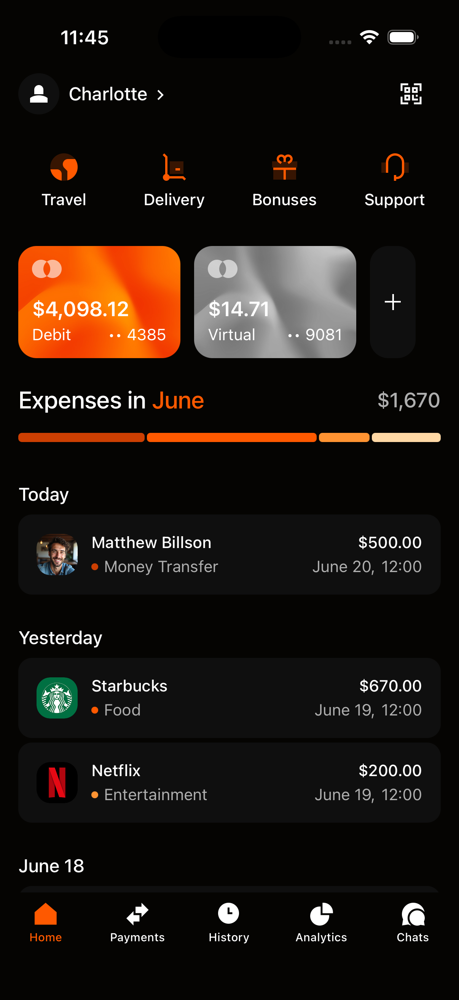
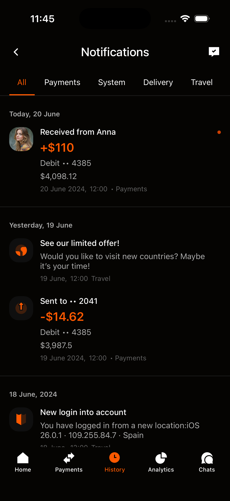

# Тестовое задание: Мобильное приложение

## Задание
Сверстать два экрана мобильного приложения согласно предоставленному макету Figma.
[**Макет дизайна**](https://www.figma.com/design/TUs0yc4YQtkpMhHvawK5iG/Test?node-id=2118-1077&p=f&t=8uuDFdewOA7mhhBg-0).

## Скринщоты экранов готового приложения

<div align="center">
  <table>
    <tr>
      <td align="center">
        <br>
        <em>Экран 1: Основной интерфейс</em>
      </td>
      <td align="center">
        <br>
        <em>Экран 2: Уведомления</em>
      </td>
    </tr>
  </table>
</div>

**Примечание**: Второй экран (уведомления) реализован в истории/навигации приложения.

# Getting Started

```sh
# Using npm
npm start

```

## Step 2: Build and run test app

```sh
# run simulator ios
npx react-native run-ios

# or run android
npx react-native run-android

```


Задание выпонил Коротков Андрей Алексеевич:

+7 (996) 918-34-35
@Ksarados1